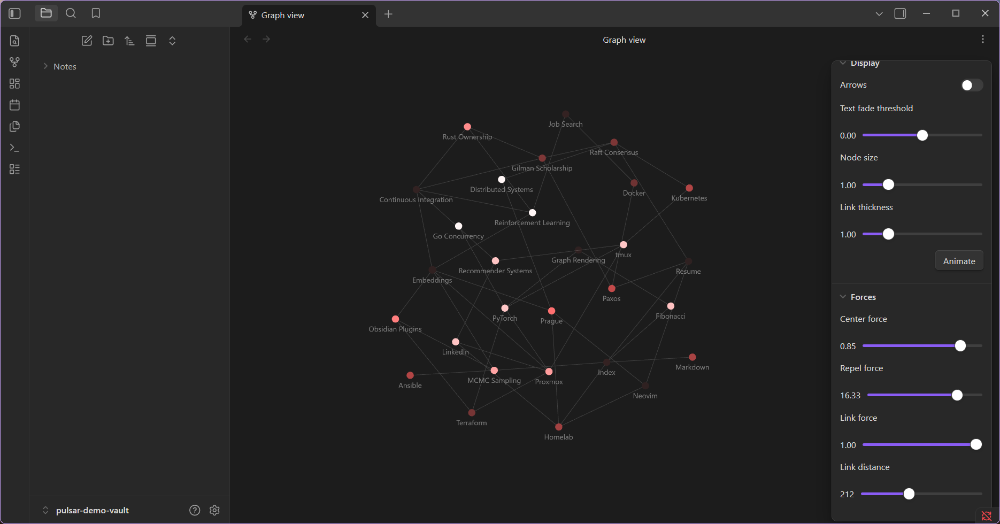
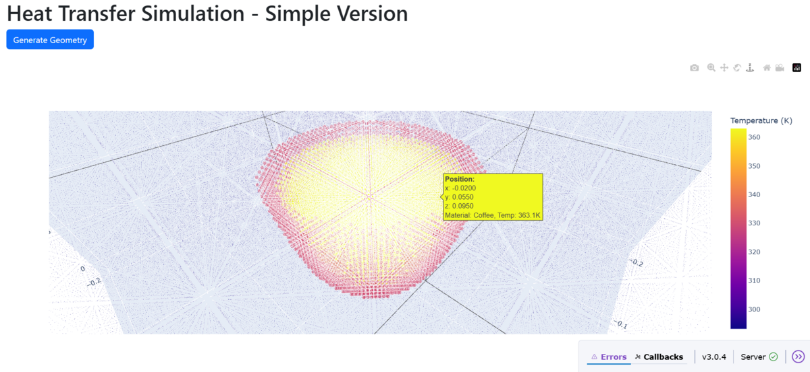

CS &amp; Applied Math @ Rutgers–Camden · US Dept. of State Gilman Scholar

  

 

---

## 🏠 Homelab

Single Proxmox node managed entirely as **Infrastructure as Code** — GitOps declarative deploys, remote Terraform state, and CI that plans every change before it touches production.

My three most important containers:
- **Tailscale subnet router** — reach everything from anywhere without exposing it to the internet
- **GPU-passthrough LXC** — CUDA and model workloads for any other container
- **CI/CD runner** — merge-to-deploy, Renovate checks Docker pins, Terraform state in Cloudflare R2

These support media, hardened Docker services, a nightly LLM agent, and full observability (Prometheus / Grafana).

**Tooling**
- SOPS + age
- Claude Code + custom skills
- SSH, workmux worktrees

**Subprojects** — GraphRAG · CUDA experiments · nightly agent · disposable sandboxed Claude Code LXCs (rootless Podman) · private finance & portfolio automation

<!-- Homelab screenshot option: you have graphana.png in Downloads — add it as assets/homelab.png and uncomment: -->
<!-- 

 -->

---

## 🛠 Building

| Project | What it does | Stack |
|:--|:--|:--|
| [**Pulsar Graph**](https://github.com/Lucas-Liona/obsidian-pulsar-graph)  | Obsidian plugin — a temporal view of your knowledge graph | `TypeScript` |
| [**Heat-Model**](https://github.com/Lucas-Liona/Heat-Model) | Heat-diffusion PDE solver — a numerical simulation with an interactive 3-D dashboard | `C++` · `pybind11` · `Python` · `Docker` |
| **IPyKanban** | A Jupyter-native kanban board | `Python` · soon |
| **Screen Weave** | Cross-device screen tooling | `Kotlin` · soon |

&nbsp;

<b>Pulsar Graph</b> — knowledge graph over time&nbsp;&nbsp;·&nbsp;&nbsp;<b>Heat-Model</b> — heat diffusion in a coffee cup

## 🧪 Experiments

| Project | What | Status |
|:--|:--|:--|
| **Street Fighter III: Third Strike** | A reinforcement-learning agent that learns to fight · `PyTorch` | `training · devlog soon` |
| **Deal Radar** | Computer-vision + web-scraping deal finder · `Python` | `in progress` |
| **LifeOS** | A self-tracking OS over my own data — TimescaleDB + pgvector, Grafana, Svelte | `live · private` |

---

## 🐚 Shell & desktop

Reproducible pieces of my setup (managed with chezmoi):
- **[zsh_config](https://github.com/Lucas-Liona/zsh_config)** — zinit-managed zsh, tuned for fast startup
- **zebar** — my status bar, clean and minimal · `releasing soon`

---

## 📊 Activity

<picture>
  <source media="(prefers-color-scheme: dark)" srcset="https://github-readme-stats.vercel.app/api?username=Lucas-Liona&show_icons=true&count_private=true&include_all_commits=true&hide_border=true&title_color=CC0033&icon_color=CC0033&text_color=c9d1d9&bg_color=00000000&rank_icon=github" />
  
</picture>
&nbsp;
<picture>
  <source media="(prefers-color-scheme: dark)" srcset="https://github-readme-stats.vercel.app/api/top-langs/?username=Lucas-Liona&layout=compact&hide_border=true&title_color=CC0033&text_color=c9d1d9&bg_color=00000000&langs_count=8" />
  
</picture>

  

<picture>
  <source media="(prefers-color-scheme: dark)" srcset="https://streak-stats.demolab.com?user=Lucas-Liona&hide_border=true&background=0d1117&ring=CC0033&fire=CC0033&currStreakLabel=CC0033&sideLabels=c9d1d9&currStreakNum=c9d1d9&sideNums=c9d1d9&dates=6e7681" />
  
</picture>

  

<!-- Snake renders after .github/workflows/snake.yml runs on main once (creates the `output` branch). -->
<picture>
  <source media="(prefers-color-scheme: dark)" srcset="https://raw.githubusercontent.com/Lucas-Liona/Lucas-Liona/output/github-snake-dark.svg" />
  <source media="(prefers-color-scheme: light)" srcset="https://raw.githubusercontent.com/Lucas-Liona/Lucas-Liona/output/github-snake.svg" />
  
</picture>

  

**[lucasliona.tech](https://lucasliona.tech)**&nbsp;·&nbsp;**[LinkedIn](https://linkedin.com/in/lucas-liona)**

